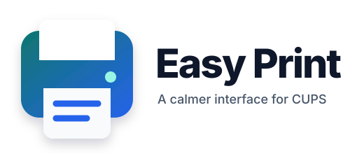
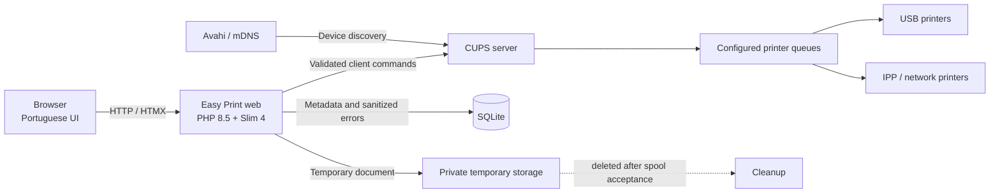

<div align="center">
  
  <h1>Easy Print</h1>
  <p><strong>A focused, printer-agnostic web interface for CUPS on self-hosted Linux.</strong></p>
  <p>Upload a document, choose a discovered queue, use only its real capabilities, and follow the print job without exposing users to the CUPS administration UI.</p>

  <p>
    
    
    
    
    <a href="LICENSE"></a>
  </p>

  <p>
    <a href="#vision">Vision</a> ·
    <a href="#mvp-scope">MVP scope</a> ·
    <a href="#architecture">Architecture</a> ·
    <a href="#roadmap">Roadmap</a> ·
    <a href="https://github.com/Thiago-Caffaro/Easy_Print/wiki">Wiki</a> ·
    <a href="CONTRIBUTING.md">Contributing</a>
  </p>
</div>

> [!IMPORTANT]
> Easy Print is currently in the planning and foundation stage. It is not ready for production use yet. The repository, Project, and Wiki describe the intended v1.0 contract without presenting planned behavior as implemented.

## Vision

Easy Print is a thin web layer over an existing CUPS server. It aims to make routine printing comfortable on a trusted local network while keeping printer discovery, drivers, spooling, and device communication where they belong: in CUPS and Avahi.

The product is intentionally small:

- **Printer-agnostic by design.** Queues and capabilities are discovered at runtime.
- **CUPS-first.** Easy Print consumes queues already configured by CUPS; it does not replace or administer the print server.
- **Self-hosted.** Linux Docker is the primary platform, with TrueNAS SCALE documented as a secondary target.
- **Server-rendered.** PHP 8.5, Slim 4, HTML/CSS, and HTMX keep the runtime understandable.
- **Private by topology.** v1.0 assumes a trusted LAN or Tailscale network and has no application login.
- **Privacy-conscious.** Uploaded documents are removed after CUPS accepts them; only operational metadata and sanitized errors remain.

## MVP scope

| Capability | v1.0 intent |
| --- | --- |
| CUPS connectivity | Validate one configured CUPS server and report availability |
| Printer queues | List and select queues already configured in CUPS |
| Dynamic options | Render only capabilities advertised by the selected queue |
| Uploads | Accept and validate PDF, PNG, and JPEG |
| Printing | Submit safe `lp` arguments and capture the CUPS job identifier |
| Queue management | Show active jobs, state, and supported cancellation |
| History | Store metadata and sanitized errors in SQLite; never retain documents |
| Interface | Portuguese first, translation-ready for English |
| Updates | Server-rendered pages with HTMX polling and minimal JavaScript |
| Deployment | AMD64 Linux Docker Compose; TrueNAS SCALE guide follows |

### Explicit non-goals for v1.0

- Adding, removing, or configuring printers in CUPS.
- Direct USB or mDNS access from the web application.
- Public internet exposure, SaaS tenancy, billing, or user accounts.
- Office-document conversion, scanner support, or ARM64 images.
- Hardcoded Epson-only settings or promises about unsupported hardware features.

## Development snapshot

The current development branches provide the executable Slim foundation, validated environment configuration, Portuguese and English catalogs, transactional SQLite metadata, a bounded allowlisted process runner, the separate web/CUPS Docker Compose topology, dynamic queue capabilities, validated print arguments, and the CUPS submission application boundary.

## Quick Start

Run Easy Print locally with Docker Compose on a Linux AMD64 host.

### Prerequisites

- Docker Engine with the Docker Compose plugin;
- access to the host network, USB device, or IPP endpoint used by the CUPS container;
- a printer configured in CUPS before submitting a document.

### Start the reference stack

From the repository root:

```bash
cp .env.example .env
docker compose up --detach --build
```

The first build downloads the PHP, CUPS, and printer-support dependencies and can take a few minutes. The default local bindings are:

| Service | Address |
| --- | --- |
| Easy Print web interface | <http://127.0.0.1:8080> |
| CUPS administration | <http://127.0.0.1:631> |

Open the Easy Print address after the containers report healthy. The application discovers queues from the CUPS service; it does not create or configure printers automatically.

### Verify the installation

```bash
docker compose ps
curl --fail http://127.0.0.1:8080/health/live
curl --fail http://127.0.0.1:8080/health/ready
docker compose exec web php /app/bin/check-cups.php
```

The readiness response must report `"status":"ok"`. If CUPS is unavailable or no queue is configured, inspect the CUPS container and configure the printer before testing a submission:

```bash
docker compose logs --follow cups
```

### TrueNAS SCALE with an existing CUPS container

If CUPS is already running separately (for example, with `network_mode: host`, USB access, Avahi, and the Epson driver), deploy only the Easy Print web container. Easy Print does not need the USB device, the CUPS configuration volume, or the CUPS spool; it consumes the queue through port 631.

The copy-and-paste example is available at [`deploy/truenas-existing-cups.yaml`](deploy/truenas-existing-cups.yaml) and is reproduced below for the TrueNAS **Install via YAML** screen:

```yaml
services:
  easy-print:
    image: docker.io/thiagocaffaro/easy-print:0.1.1
    container_name: easy-print

    environment:
      APP_ENV: production
      APP_DEBUG: "false"
      APP_LOCALE: pt-BR
      APP_ENABLED_LOCALES: pt-BR,en
      CUPS_HOST: 192.168.1.20
      CUPS_PORT: "631"
      CUPS_ENCRYPTION: never
      CUPS_SERVER_KEY: truenas-cups
      DATABASE_PATH: /var/lib/easy-print/easy-print.sqlite
      TEMPORARY_PATH: /var/lib/easy-print/tmp
      COOKIE_SECURE: "false"
      LOG_LEVEL: info
      HISTORY_RETENTION_DAYS: "90"
      ERROR_RETENTION_DAYS: "30"

    ports:
      - "127.0.0.1:8080:8080"

    volumes:
      - /mnt/POOL/Apps/easy_print/data:/var/lib/easy-print

    tmpfs:
      - /var/lib/easy-print/tmp:uid=10001,gid=10001,mode=0770
      - /tmp:uid=10001,gid=10001,mode=1770

    read_only: true
    cap_drop:
      - ALL
    security_opt:
      - no-new-privileges:true
    init: true
    restart: unless-stopped
```

Before deploying, replace `192.168.1.20` with the TrueNAS address reachable from the container and replace `/mnt/POOL/Apps/easy_print/data` with an existing dataset path. The fixed version tag avoids accidentally reusing a cached `latest` image; update the tag deliberately when upgrading. Use `0.2.0` or newer once that release is published.

Prepare the dataset from the TrueNAS Shell (as root):

```sh
mkdir -p /mnt/POOL/Apps/easy_print/data
chown -R 10001:10001 /mnt/POOL/Apps/easy_print/data
chmod -R 750 /mnt/POOL/Apps/easy_print/data
```

The parent directories must allow UID `10001` to traverse them. If the dataset uses ACLs, grant that UID traverse permission on the parents and read/write/execute permission on `data`. Do not change the container to run as `apps`; the image and its temporary filesystem are designed for UID `10001`.

After deployment, check the container and the CUPS boundary:

```sh
sudo docker ps -a
sudo docker logs --tail 80 easy-print
sudo docker exec easy-print lpstat -h 192.168.1.20:631 -p -d
sudo docker exec easy-print lpoptions -h 192.168.1.20:631 -p EPSON_L4150_Series -l
```

The last command must list the options advertised by the selected driver. Easy Print renders those capabilities dynamically, including all media types, paper sizes, color modes, quality settings, and any other options the queue exposes. It does not hardcode Epson features. Some drivers expose technical choice identifiers (for example, `PMPHOTO_HIGH`) rather than localized labels; the selected identifier is passed to CUPS unchanged.

#### TrueNAS installation troubleshooting

| Symptom | Cause | Fix |
| --- | --- | --- |
| `DATABASE_PATH is not writable` | The bind-mounted dataset is owned by another UID or a parent directory cannot be traversed | Set ownership to `10001:10001`, mode `750`, and grant parent traverse permission |
| `TEMPORARY_PATH is not writable` | `tmpfs` was declared without `uid`, `gid`, and `mode` options | Use the two `tmpfs` declarations shown above, then redeploy |
| Container restarts with exit 255 | The startup migration fails repeatedly, usually because one of the runtime directories is not writable | Inspect `docker logs`, correct the dataset/tmpfs permissions, and recreate the app |
| Queue is missing | `CUPS_HOST` is wrong, port 631 is blocked, or CUPS is not sharing the queue | Test `lpstat` from the Easy Print container and confirm the queue in CUPS |
| Queue is visible but controls are unavailable | `lpoptions` cannot reach the PPD, or an old image rejected valid driver choices | Test `lpoptions` directly and use the latest published image |
| Localhost URL is unreachable from another device | `127.0.0.1:8080` intentionally binds only to TrueNAS | Use Tailscale Serve/reverse proxy, or bind a LAN address only behind an appropriate firewall |
| `latest` did not change after an update | Docker/TrueNAS reused a cached tag | Use a fixed version tag, redeploy, or explicitly pull the new image |

The CUPS administrator password is not required by Easy Print for normal client operations. Keep it out of YAML files, screenshots, commits, and support logs. The current image targets Linux AMD64; ARM64 is not supported yet.

### Stop and reset the local stack

Stop the containers while preserving SQLite metadata and CUPS configuration:

```bash
docker compose down
```

To remove the local volumes and all stored metadata/configuration, use the destructive reset only when you intend to start over:

```bash
docker compose down --volumes
```

For environment variables, PHP development, migrations, backups, and production/private-network deployment, continue with [Development](docs/development.md), [Configuration](docs/configuration.md), and [SQLite backup and recovery](docs/database-recovery.md).

Change the default bind addresses only when the host firewall, LAN, Tailscale, or reverse proxy is intentionally providing the access boundary.

For local PHP development and all quality commands, see [Development](docs/development.md). Runtime variables are documented in [Configuration](docs/configuration.md), migrations and retention fields are covered in [Database](docs/database.md), and runtime contracts are described in [CUPS queue discovery](docs/cups-discovery.md), [CUPS queue capabilities](docs/cups-capabilities.md), [Queue selection and state](docs/queue-selection.md), [Print argument validation](docs/print-argument-validation.md), [Print job submission](docs/print-submission.md), [Active print jobs](docs/active-jobs.md), [Secure PDF uploads](docs/pdf-uploads.md), [Secure image uploads](docs/image-uploads.md), [HTTP security](docs/http-security.md), [Observability and health](docs/observability.md), [Private network deployment](docs/network-deployment.md), and [Web container security](docs/container-security.md).

## Architecture



The reference package uses separate containers for the web application and CUPS/Avahi. The web container receives only the network and storage access it needs; it does not receive the USB device or the complete CUPS spool.

### Proposed code boundaries

```text
app/
├── Application/       Use cases and DTOs
├── Domain/            Queue, capability, print job, and history rules
├── Infrastructure/    CUPS, SQLite, process, filesystem, and clock adapters
├── Http/              Slim actions and middleware
├── Translation/       pt-BR and en catalogs
└── Views/             Pages, HTMX fragments, and view models
config/                Validated runtime configuration
public/                Front controller and public assets only
storage/               Private runtime state and temporary files
tests/
├── Unit/
├── Integration/
└── Fixtures/Cups/     Sanitized deterministic CUPS outputs
```

Directories will be introduced with the first vertical slices instead of being committed empty.

## Core business flow

1. Check the configured CUPS server and enumerate its queues.
2. Select a queue and read its defaults, state, and supported values.
3. Validate the uploaded PDF, PNG, or JPEG outside the public webroot.
4. Validate every print option against the selected queue capability snapshot.
5. execute an allowlisted CUPS client command with separated arguments and a timeout.
6. Capture the CUPS job identifier and delete the uploaded document after spool acceptance.
7. Reconcile job state from CUPS while recording metadata and sanitized failures locally.

## Security model

Easy Print treats the browser, uploaded files, queue names, CUPS output, and print-option values as untrusted data. The implementation must provide CSRF protection, format-specific upload validation, random private filenames, path containment, process timeouts, command allowlists, option allowlists, safe error rendering, and bounded logs.

Network trust is a deployment requirement, not a substitute for application safety. See the [Security Policy](SECURITY.md) and the [Wiki security model](https://github.com/Thiago-Caffaro/Easy_Print/wiki/Security-Model).

## Deployment model

The supported reference topology will be delivered through Docker Compose:

```text
compose.yaml
├── web          Easy Print, PHP runtime, CUPS client tools
└── cups         CUPS, Avahi, printer drivers/applications, USB/network access
```

Linux Docker on AMD64 is the primary target. TrueNAS SCALE uses the same service boundaries with platform-specific storage, networking, and USB guidance.

## Roadmap

| Phase | Outcome |
| --- | --- |
| Foundation | Repository governance, PHP/Slim bootstrap, container topology, CI, configuration, fixtures |
| MVP Printing | Queue discovery, capability-driven form, PDF/PNG/JPEG upload, submission, jobs, cancellation, history |
| Operational Hardening | Security controls, cleanup, observability, production containers, recovery documentation |
| v1.0 Readiness | English translation, accessibility, real-printer matrix, release packaging, screenshots |
| Future Exploration | Direct IPP evaluation, office formats, scanning, ARM64 |

The actionable backlog lives in [GitHub Issues](https://github.com/Thiago-Caffaro/Easy_Print/issues) and the linked [GitHub Project](https://github.com/Thiago-Caffaro/Easy_Print/projects).

## Documentation

- [Project Wiki](https://github.com/Thiago-Caffaro/Easy_Print/wiki) — architecture, domain model, operations, testing, and troubleshooting.
- [Contributing Guide](CONTRIBUTING.md) — development and pull-request workflow.
- [Security Policy](SECURITY.md) — supported versions and private reporting.
- [Architecture decisions](docs/decisions/) — decisions that must evolve with code.
- [Print history](docs/print-history.md) — metadata contract, pagination, reconciliation, and retention behavior.
- [Printer status](docs/printer-status.md) — read-only CUPS state, reason mapping, and refresh behavior.
- [Error taxonomy](docs/error-taxonomy.md) — stable codes, localized presentation, and diagnostic boundaries.
- [Testing strategy](docs/testing.md) — deterministic fake-CUPS coverage and physical-printer evidence rules.
- [CUPS recovery contract](docs/cups-recovery.md) — outage, stale-state, and dependency-recovery behavior.

## Contributing

The project welcomes focused Issues and pull requests. Please read [CONTRIBUTING.md](CONTRIBUTING.md), start from an accepted Issue, keep changes small, and include verification evidence.

## License

Easy Print is available under the [MIT License](LICENSE).

<div align="center">
  <sub>Designed for calm, predictable printing on networks you control.</sub>
</div>
